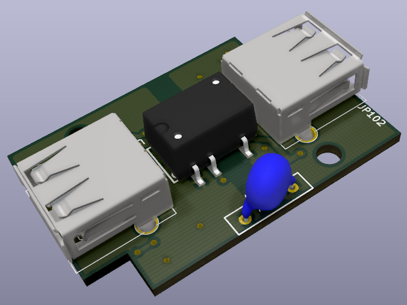

USB2.0 GALVANIC ISOLATOR(2.5kV, 400mA, Low/Full Speed Support)

Introduction

 
The direct connection of 5V and GND lines between an USB device and your PC is might be problem, and it can bring some electrical faults of the USB devices. This ground loop problems could damage your PC. This is exactly what the USB isolator will remove.

 
The isolator will create a new ground for the USB device so that it doesn't have to share ground with your computer and other devices you might have connected in the same house.
The device is provides galvanic isolation betweeen hosts(such as pc) and peripheral devices. 

Design

<strong>ADUM3160</strong><a href="https://www.analog.com/media/en/technical-documentation/data-sheets/ADuM3160.pdf" style="color:yellow"> (datasheet)</a> digital isolator is compliant with the USB2.0 specification for full and low speed operation. The PDEN(pull-down enable) pin is connected to the Vdd1(upstream side) for standart operation. Thus ADUM3160 will provide  automatic speed detection(1.5Mbit/s to 12Mbit/s) with 2500 Vrms galvanic isolation. 

To be able to supply the USB device, an isolated 5V to 5V, 2W DC/DC converter(<strong>F0505XT-2WR2</strong><a href="https://www.signal.com.tr/pdf/cat/F_XT-2WR2.pdf" style="color:yellow"> (datasheet)</a> ) is added which is able to deliver 400mA at 5V. It doesn't required externel component except Y cap and bypass capacitors. The resistors on the data lines are for keep the differential pair stable state. 

For voltage protection, bidirectional TVS diode arrays(<strong>NUP3105L</strong>
<a href="https://www.onsemi.com/pub/Collateral/NUP3105L-D.PDF" style="color:yellow">(datasheet)</a>
) connected to the each side.

Schematic and PCB were done with <a href="https://kicad.org/" style="color:yellow"> KiCAD</a>:

 

 

 

Just a preview:

 

 

